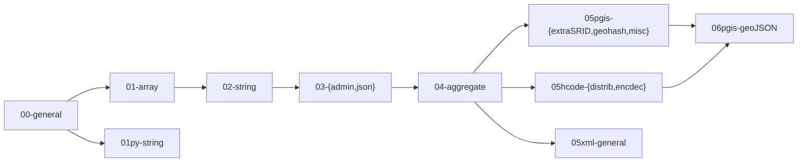

**SUMMARY**

* [Introduction](intro.md)
* [Installation](install.md)
* Function Guide, by group:
    - [hcode](hcode.md)
    - [pgis](pgis.md)

## Dependencies
The SQL source code, at [/src](http://git.AddressForAll.org/pg_pubLib-v1/tree/main/src), files in the form `pubLib*.sql` have its `*` part as labels in the folowing dependency diagram:

