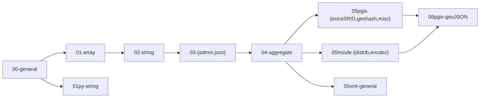

Edit makefile of your project to run each `psql $(pg_uri)/$(pg_db) < pubLib$(i).sql` in the correct order. For example any `pubLib02-*.sql` must run before `pubLib03-*.sql`, but same order like `pubLib03-admin.sql` and `pubLib03-json.sql` can be run in any order &mdash; by convention we adopt the alphabetic order, so use the `ls pubLib*.sql` order.

RECOMMENDATION: to install (in a database) only the used modules.

RATIONALE: each database in each project can use a different set of pubLib functions. It is good practice to avoid "namespace pollution" with unused functions, so, the pubLib modularization makes a reasonable partition over this "pollution risk".

## Dependencies
The SQL source code, at [/src](http://git.AddressForAll.org/pg_pubLib-v1/tree/main/src), files in the form `pubLib*.sql` have its `*` part as labels in the folowing dependency diagram:


<!-- Strictly speaking it is just an "installation sequence" diagram, the dependency between functions can have a simpler chain.-->

## Installing all library

Use `make instAll` to install all scripts, or install at database *db* a specific one like *array*,

```sh
psql postgres://postgres@localhost/db < pubLib01-array.sql
```

SQL scripts of [`/src`](../src) with *pgis* (file named `pubLib{depLevel}pgis-{name}.sql`) or *py* (named `pubLib{depLevel}py-{name}.sql`) are exceptions, need some more installing procedures.

## py dependences
All Python functions are standard Python3, and need  PLpython3 untrusted module:
```sh
sudo apt install  postgresql-plpython3-13
```

Special modules need some install procedures by *pip*, but to be visible at postgreSQL need `sudo pip`  and `unmask` for permission. Example with Mustasche template Chevron module:
```sh
# pegadinha no path de instalação do módulo, ver https://stackoverflow.com/a/69811157/287948
sudo su
cd ~
umask 022
sudo pip3 install  chevron
```

## pgis dependences

Use `apt` or instructions at https://postgis.net/install/
