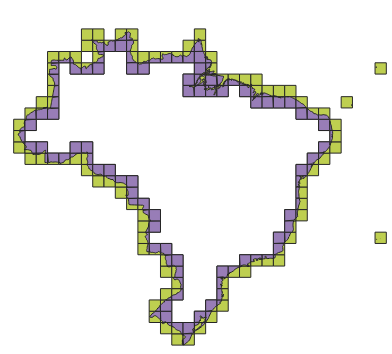
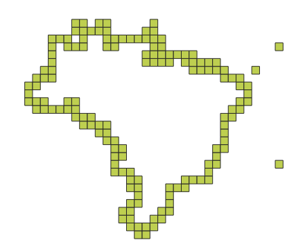
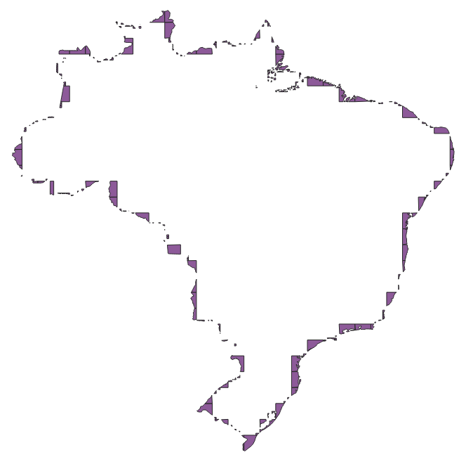
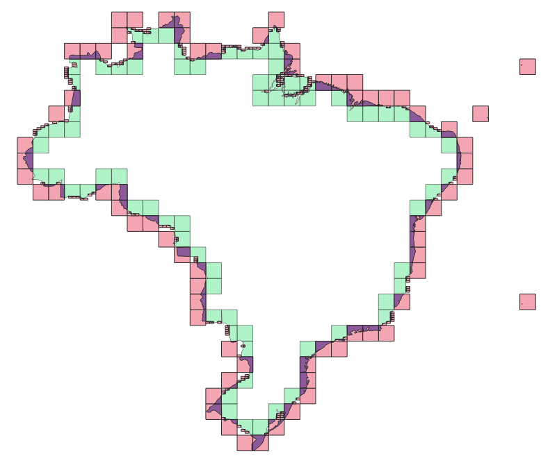
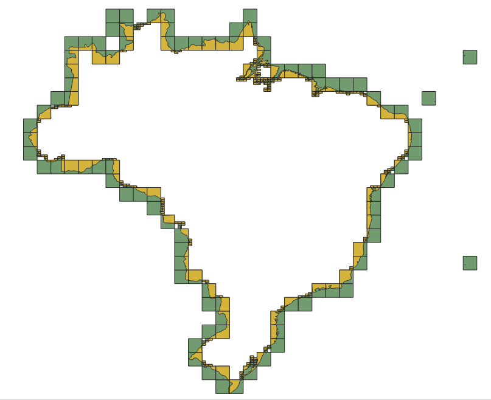
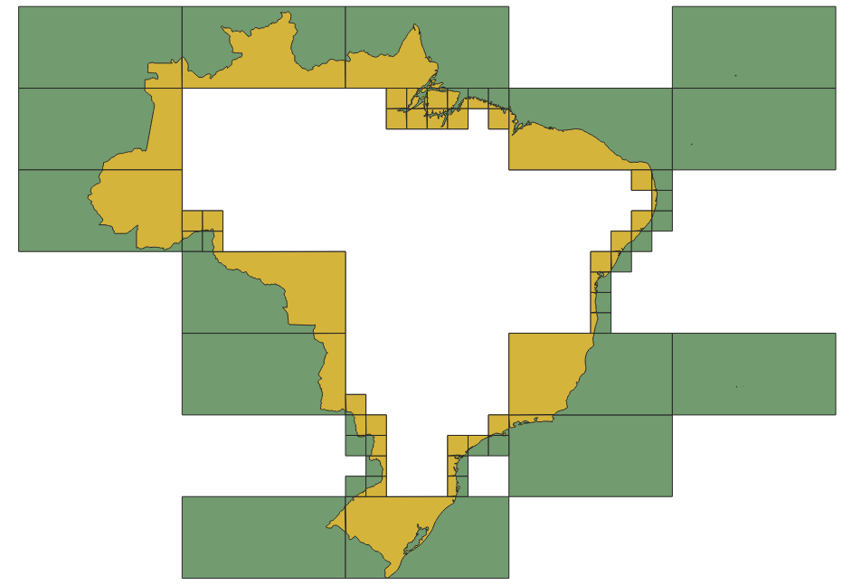
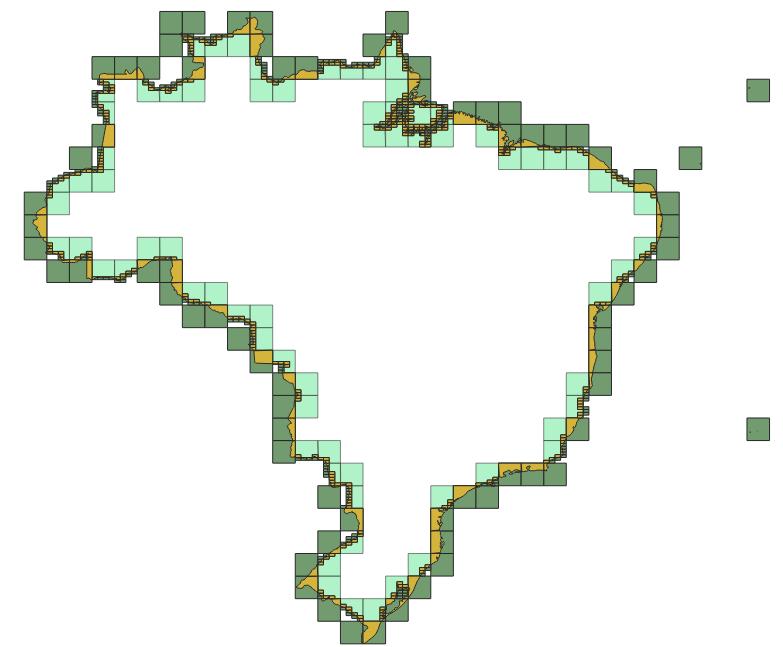
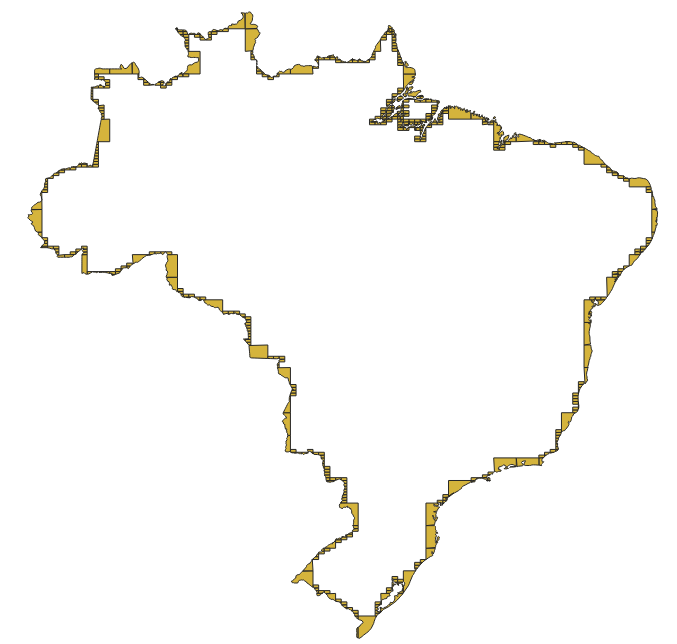
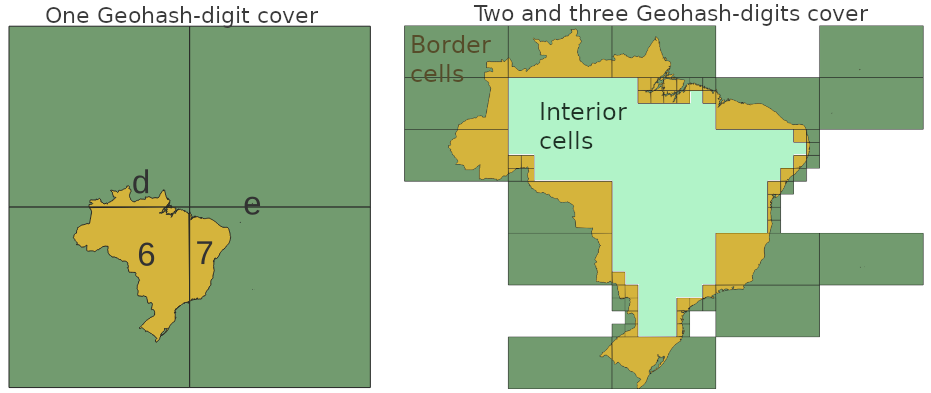

## Step-by-step

Some examples using the function [`geohash_cover_list(geom,prefix,onlycontained)`](https://github.com/AddressForAll/pg_pubLib-v1/blob/main/src/pubLib05pgis-geohash.sql#L22) and its variations, showing its algorithm behaviour in a handicraft step-by-step.

IMPORTANT: the `onlycontained` parameter,
* when `true`,
determines that  "only contained cells" (**interior cells**) will be returned;
*  wnen `false` (default) only contour cells (**border**);
* `NULL` determines that both (**interior+border**) will be returned.

### Brazil, recurrence for border coverage

Example results of using *Cover_list* with Brazil country boundaries:

```sql
CREATE VIEW br_geom AS
  SELECT geom  -- BRazil polygon
  FROM ingest.fdw_jurisdiction_geom
  WHERE isolabel_ext='BR';

SELECT geohash_cover_list(geom) FROM br_geom; -- using default, onlycontained=false (border)
  --  {6,7,d,e}
SELECT geohash_cover_list(geom,'6') FROM br_geom;
  -- {6d,6f,6g,6q,6r,6s,6t,6u,6v,6w,6x,6y,6z} ; cardinality=13
SELECT cardinality(geohash_cover_list(geom,'6qm')) FROM br_geom;
  -- 32  (the cell '6qm' is contained into Brazil)
```
We don't need to check cardinality to know that a cell is fully contained: a small modification in the function, and using JSON objects instead of arrays, allows us to control the criterion. *Cover_testlist* do the work:

```sql
SELECT geohash_cover_testlist(geom) FROM br_geom;
  -- Result: {"6": false, "7": false, "d": false, "e": false}.  A recurrence over "6":
SELECT geohash_cover_testlist(geom,'6') FROM br_geom;
  -- Result: {"6d": false, "6f": false, "6g": false, "6q": false, "6r": false, "6s": false, "6t": false, "6u": false,
  --   "6v": true, "6w": false, "6x": true, "6y": true, "6z": false}. A recurrence over "6g":
SELECT geohash_cover_testlist(geom,'6g') FROM br_geom;
  -- {"6g0": false, "6g1": false, "6g3": false, "6g4": true, "6g5": true, "6g6": true, "6g7": true, "6g8": false, ...}
```

The staep by step shwos that we can set a maximum number of digits, keeping only the Geohashes indicated as *false* (not fully contained in Brazil), and get all of them by recurrence.

Now, to view at [QGIS](https://en.wikipedia.org/wiki/QGIS) or other iterface, we need geometries, so use *CoverContour_geoms*.  The illustration below shows the result in QGIS overlaying the cut geometries with the pure cell geometries (boxes). Three tables was prepared for QGIS output:

```sql
CREATE TABLE qgis_output1 AS
  SELECT *  -- Brazil as subquery
  FROM  geohash_coverContour_geoms(  (SELECT geom FROM br_geom),  3   ) g
; -- 147 rows
CREATE TABLE qgis_output2 AS
  SELECT g.*      -- an useful SQL alternative for subquery:
  FROM br_geom b, LATERAL geohash_coverContour_geoms_splitarea(b.geom, 3, 0.5 ) g
; -- 575 rows
CREATE TABLE qgis_output3 AS
  SELECT g.*
  FROM br_geom b, LATERAL geohash_coverContour_geoms_splitarea(b.geom, 2, 0.5 ) g
; -- 56 rows
```


*QGIS_output1* (side illustration). Regular 3-digits Geohash cells "cover contour" (or "cover outline"), with no recursion, using `geohash_coverContour_geoms` function. In purple the `geom_cut`  and `geom`  as its cell, in green at backgroun.
<!-- 




 -->

 Bellow the examples using *CoverContour_geoms_splitarea* function. It do only a two-step  recurrence: first calling *CoverContour_geoms*, then, when  *area_factor* of a cell is less than a threshold, calling *Cover_geoms* for that cell.

*QGIS_output2*. In yellow the `geom_cut`,  and `geom`  as its cell in darkened green background.  Original parent cells of  `geom_cut` are in light-green background  &mdash; obtained as `geom`  from *QGIS_output1*, enhancing "interior side" of the yellow contour.



The yellow "pixelized contour" (from `geom_cut`) has 3-digit Geoash cells on regular boundary lines, and 4-digit on more complex and irregular boundary lines. Below it was isolated to enhance it. <br/>PS: see also holes in the contour, at [bugged 50%](assets/br_contourBug-50perc-onlyCut.png), produced when interior cells are not used in the recurrence.



*QGIS_output3* was illustrated in the right side of the comparison below. The two-digit Geohash as main grid, and 3-digit as secondary, when primary has more than 50% of its area contained into the country. See also [assets/br_contour-50perc](assets/br_contour-50perc-2digits.png) and it's [contourOnly of `geom_cut`](assets/br_contourOnly-50perc-2digits.png).

Comparing 1-digit and more-digits covers: ideal is the minimal of 50% of covered area in each cell.  See a counter-example of [80% contour](assets/br_contour-80perc.png).



Typical application is to detect the jurisdiction of a Geohash-point by its prefix. The strategy is to minimize both, the number of (big) cover-cells of the country, and the area of the contour-cover cells. The supposed result is to optimize the performancem, by reducing the number and area of multi-country cells.
<br/>PS: real-life jurisdiction detection use the buffer of Territorial waters instead terrestral borders. We can use a [bloom filter](https://www.postgresql.org/docs/14/bloom.html) for 2 or 3-digit prefix of a list of a jurisdiction table country-contained cells.


All `geohash_coverContour*()` function can use a Recursive CTE (common table expression) as kernel algorithm:

```SQL
WITH RECURSIVE rcover(ghs, is_contained, geom) AS (  -- geohash_cover_noncontained_recursive()
  SELECT *    -- non-recursive part
  FROM geohash_cover_geom(input_geom,prefix0,cut) t0
 UNION ALL
  SELECT c.*
  FROM rcover,   -- recursive part
       LATERAL geohash_cover_geom(input_geom,rcover.ghs,cut) c
  WHERE length(rcover.ghs)<ghs_len AND NOT(c.is_contained) AND NOT(rcover.is_contained)
)
SELECT ghs, geom FROM rcover WHERE length(ghs)=ghs_len;
```

To understand Recursive CTE, just revisit [a didactic example](https://towardsdatascience.com/recursive-sql-queries-with-postgresql-87e2a453f1b):

```SQL
WITH RECURSIVE rec_nums (n,k) -- remember a CREATE TABLE statement, not a function
AS (
     SELECT 1, 4    -- non-recursive part
   UNION ALL
     SELECT n+1, 5  -- recursive part
     FROM rec_nums WHERE n+1 < 8
 ), filtered AS (    -- chaining WITH statements
   SELECT * FROM rec_nums WHERE k=4 OR n>3
 ) SELECT * FROM filtered;
```

### Niteroi, cobertura análoga BBOX

Exemplo de resultados com o Niteroi, o município está inteiramente contido em um só Geohash, de 4 dígitos. A primeira cobertura é análoga a uma "mínimal boundary box" (BBOX), que usa igualmente a grade do sistema de coordenadas como delimitador de caixa, mas no sentido de "mínimo Geohash" ao invés de mínimo do sistema. No exemplo em seguida `geohash_cover_testlist()` mostra a cobertura de 4 dígitos, e que apenas a célula `75cms` está totalmente contida no município.

```sql
select geohash_cover(geom) from  ingest.fdw_jurisdiction_geom where isolabel_ext='BR-RJ-Niteroi';
-- {75cm}
select geohash_cover_testlist(geom,'75cm') from  ingest.fdw_jurisdiction_geom where isolabel_ext='BR-RJ-Niteroi';
-- true:75cms; false:{75cm5,75cm6,75cm7,75cmd,75cme,75cmf,75cmg,75cmh,75cmk,75cmm,75cmt,75cmu,75cmv,75cmw}
```

### Encapsulating distributions

See [hcode-distrib](hcode-distrib.md) as application:

1. showing the **equivalency** between `geohash_cover_list()` and aggregated list of distinct Geohash prefixes.
2. using optimized lists

```SQL
CREATE VIEW ec_testPoints_geom AS -- file "numeracion_casas_t_direcc.shp" of EC-F-Azogues, a geoaddress_full example.
  SELECT ST_Collect(geom) AS geom FROM ingest.feature_asis WHERE file_id=54
;
CREATE VIEW ec_azores_geom AS
  SELECT geom FROM ingest.fdw_jurisdiction_geom where isolabel_ext='EC-F-Azogues'
;
SELECT geohash_cover_list(geom) FROM ec_testPoints_geom
; -- {6pxbm}
SELECT geohash_cover_list(geom,'6pxbm') FROM ec_testPoints_geom
; -- {6pxbmg,6pxbms,6pxbmt,6pxbmu,6pxbmv,6pxbmw,6pxbmy}
SELECT array_agg( DISTINCT substr(kx_ghs9,1,6) ) AS list6 FROM ingest.feature_asis WHERE file_id=54;
  -- {6pxbmg,6pxbms,6pxbmt,6pxbmu,6pxbmv,6pxbmw,6pxbmy}

SELECT geohash_cover_list(geom) FROM ec_azores_geom;     -- {6}
SELECT geohash_cover_list(geom,'6') FROM ec_azores_geom; -- {6p,6r}
```

### Mosaicos de distribuição balanceada

Resumo dos requsitos de uma distribuição balanceada pelo tamanho dos arquivos formados por conjuntos de geometrias, tentando primeiro pelos Geohashes de maior área (menos dígitos), depois recorrentemente os seus filhos:

- Se pai pode conter tudo (ocupa menos que size_max), resolvido, ficamos com ele e fim.
- Senão pai é distribuída em filhos e pai absorve "poeira" (filhos com menos que  size_min).
- A cada filho grande demais (mais que size_max), recorrência usando ele como pai.
- A recorrência também encerra se número de dígitos Geohash passarem do limite (ghs_len).

Temos dois tipos de geometria aqui: a geometria da "máscara", dos limites da jurisdição, como nos exemplos acima, e as geometrias da distribuição.

Decisões de projeto:

1. O conjunto das geometrias da distribuição pode ser substituído por células geohash pequenas, que serão depois agrupadas por prefixo. O tamanho em bytes do grupo também pode ser calculado.

2. Estratégia de implementação: criar uma nova versão da função `geohash_cover_geom()` que aceite mais um parâmetro, a distribuição, e retorne mais uma coluna, contendo a estimativa em bytes.

...
