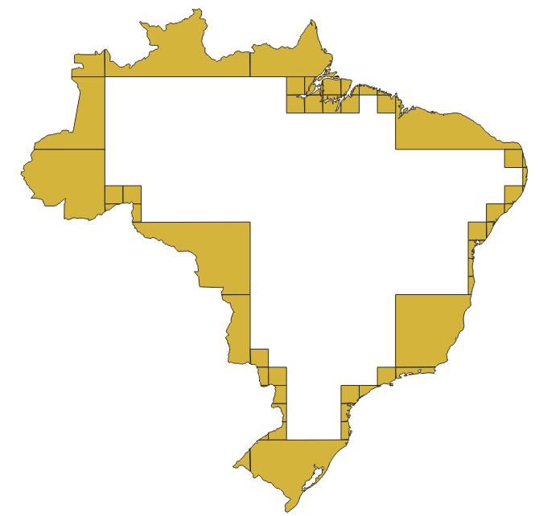
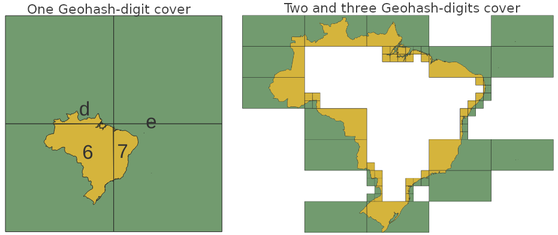

## Step-by-step

Alguns exemplos usando passo-a-passo mais grosseiro e artesanal, usando apenas a função [geohash_cover(geom,prefix)](https://github.com/AddressForAll/pg_pubLib-v1/blob/main/src/pubLib05pgis-geohash.sql#L22).

### Brasil, recorrencia para cobertura da fronteira
Exemplo de resultados do uso de Geohash_cover com os limites de país do Brasil:

```sql
CREATE VIEW br_geom AS SELECT geom FROM ingest.fdw_jurisdiction_geom where isolabel_ext='BR';

SELECT geohash_cover_list(geom) FROM br_geom;
  --  {6,7,d,e}
SELECT geohash_cover_list(geom,'6') FROM br_geom;
  -- {6d,6f,6g,6q,6r,6s,6t,6u,6v,6w,6x,6y,6z} ; cardinality=13
SELECT cardinality(geohash_cover_list(geom,'6qm')) FROM br_geom;
  -- 32  (a célula '6qm' está totalmente contida no Brasil)
```
Não precisamos conferir a cardinalidade para saber que uma célula está totalmente contida: uma pequena modificação na função, e usando objetos json ao invés de arrays, nos permite controlar o critério.

```sql
select geohash_cover_testlist(geom) FROM  br_geom;
  -- {"6": false, "7": false, "d": false, "e": false}
select geohash_cover_testlist(geom,'6') FROM br_geom;
  --  {"6d": false, "6f": false, "6g": false, "6q": false, "6r": false, "6s": false, "6t": false, "6u": false,
  --   "6v": true, "6w": false, "6x": true, "6y": true, "6z": false}
select geohash_cover_testlist(geom,'6g') FROM br_geom;
  -- {"6g0": false, "6g1": false, "6g3": false, "6g4": true, "6g5": true, "6g6": true, "6g7": true, "6g8": false, ...}
```

Podemos estabelecer um número máximo de dígitos, mantendo apenas os geohashes indicados como *false* (não totalmente contidos no Brasil), e obter todos eles por recorrência. A ilustração abaixo mostra o resultado no QGIS sobrepondo as geometrias recortadas (cut) às geometrias de célula puras (boxes).

```sql
CREATE TABLE qgis_output1 AS
  SELECT g.*
  FROM br_geom b, LATERAL geohash_coverContour_geoms(b.geom,3) g
; -- 147 rows
CREATE TABLE qgis_output2 AS
  SELECT g.*
  FROM br_geom b, LATERAL geohash_coverContour_geoms_splitarea(b.geom, 3, 0.5 ) g
; -- 575 rows
CREATE TABLE qgis_output3 AS
  SELECT g.*
  FROM br_geom b, LATERAL geohash_coverContour_geoms_splitarea(b.geom, 2, 0.5 ) g
; -- 56 rows
```

QGIS_output1. Regular 3-digits Geohash cells "cover contour", with no recursion, using `geohash_coverContour_geoms` function:


<!-- 


 -->
QGIS_output2. Bellow examples using `geohash_coverContour_geoms_splitarea()` function.
In yellow the `geom_cut`  and `geom`  as its cell, in green.  Original parent-cells in light green background, from QGIS_output1.


Same, but only `geom_cut`:


QGIS_output3. Two-digit Geohash as main grid, and 3-digit as secondary, when primary has more than 50% of its area contained into the country. See also [assets/br_contour-50perc](assets/br_contour-50perc-2digits.png), bellow the contour-only, `geom_cut`.

Typical application is to detect the jurisdiction of a Geohash-point by its prefix. The strategy is to minimize both, the number of (big) cover-cells of the country, and the area of the contour-cover cells. The supposed result is to optimize the performancem, by reducing the number and area of multi-country cells.
<br/>PS: real-life jurisdiction detection use the buffer of Territorial waters instead terrestral borders.



Comparing 1-digit and more-digits covers: ideal is the minimal of 50% of covered area in each cell.  



All `geohash_coverContour*()` function are using this Recursive CTE (common table expression) as kernel algorithm:

```SQL
WITH RECURSIVE rcover(ghs, is_contained, geom) AS (  -- geohash_cover_noncontained_recursive()
  SELECT *    -- non-recursive part
  FROM geohash_cover_geom(input_geom,prefix0,cut) t0
 UNION ALL
  SELECT c.*
  FROM rcover,   -- recursive part
       LATERAL geohash_cover_geom(input_geom,rcover.ghs,cut) c
  WHERE length(rcover.ghs)<ghs_len AND NOT(c.is_contained) AND NOT(rcover.is_contained)
)
SELECT ghs, geom FROM rcover WHERE length(ghs)=ghs_len;
```
Para entender a recorrência basta revisitar [um exemplo didático](https://towardsdatascience.com/recursive-sql-queries-with-postgresql-87e2a453f1b):

```SQL
WITH RECURSIVE rec_nums (n,k) -- remember a CREATE TABLE statement, not a function
AS (
     SELECT 1, 4    -- non-recursive part
   UNION ALL
     SELECT n+1, 5  -- recursive part
     FROM rec_nums WHERE n+1 < 8
 ), filtered AS (    -- chaining WITH statements
   SELECT * FROM rec_nums WHERE k=4 OR n>3
 ) SELECT * FROM filtered;
```

### Niteroi, cobertura análoga BBOX

Exemplo de resultados com o Niteroi, o município está inteiramente contido em um só Geohash, de 4 dígitos. A primeira cobertura é análoga a uma "mínimal boundary box" (BBOX), que usa igualmente a grade do sistema de coordenadas como delimitador de caixa, mas no sentido de "mínimo Geohash" ao invés de mínimo do sistema. No exemplo em seguida `geohash_cover_testlist()` mostra a cobertura de 4 dígitos, e que apenas a célula `75cms` está totalmente contida no município.

```sql
select geohash_cover(geom) from  ingest.fdw_jurisdiction_geom where isolabel_ext='BR-RJ-Niteroi';
-- {75cm}
select geohash_cover_testlist(geom,'75cm') from  ingest.fdw_jurisdiction_geom where isolabel_ext='BR-RJ-Niteroi';
-- true:75cms; false:{75cm5,75cm6,75cm7,75cmd,75cme,75cmf,75cmg,75cmh,75cmk,75cmm,75cmt,75cmu,75cmv,75cmw}
```

### Encapsulando distribuições

See [hcode-distrib](hcode-distrib.md) as application: ....

### Mosaicos de distribuição balanceada

Resumo dos requsitos de uma distribuição balanceada pelo tamanho dos arquivos formados por conjuntos de geometrias, tentando primeiro pelos Geohashes de maior área (menos dígitos), depois recorrentemente os seus filhos:

- Se pai pode conter tudo (ocupa menos que size_max), resolvido, ficamos com ele e fim.
- Senão pai é distribuída em filhos e pai absorve "poeira" (filhos com menos que  size_min).
- A cada filho grande demais (mais que size_max), recorrência usando ele como pai.
- A recorrência também encerra se número de dígitos Geohash passarem do limite (ghs_len).

Temos dois tipos de geometria aqui: a geometria da "máscara", dos limites da jurisdição, como nos exemplos acima, e as geometrias da distribuição.

Decisões de projeto:

1. O conjunto das geometrias da distribuição pode ser substituído por células geohash pequenas, que serão depois agrupadas por prefixo. O tamanho em bytes do grupo também pode ser calculado.

2. Estratégia de implementação: criar uma nova versão da função `geohash_cover_geom()` que aceite mais um parâmetro, a distribuição, e retorne mais uma coluna, contendo a estimativa em bytes.

...
